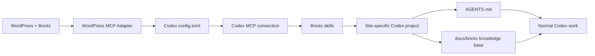

# Bricks + Codex MCP Starter

Reusable starter kit for connecting **Bricks Builder + WordPress MCP + Codex**, initializing a safe Codex project, auditing an existing site, and maintaining a durable site-specific knowledge base.

> **Status:** evolving working draft. Bricks AI abilities are currently experimental. The Bricks documentation recommends first testing on local/staging environments.

---

# Magyar

## Mi ez?

Ez a repository egy általános, site-agnosztikus kezdőcsomag Bricks Builder + Codex projektekhez.

Nem egy konkrét webhely dokumentációját tartalmazza. Ehelyett olyan:

- setup wizardot;
- alapértelmezett `AGENTS.md`-t;
- bootstrap audit promptot;
- design-system workflow-kat;
- dokumentációs sablonokat;
- biztonsági és jogosultsági szabályokat

ad, amelyeket minden új Bricks projektnél újra lehet használni.

A cél az, hogy egy új Bricks site-nál ne kelljen minden alkalommal nulláról kitalálni:

- hogyan kapcsolódjon a Codex az MCP-hez;
- milyen biztonsági szabályokkal dolgozzon;
- hogyan térképezze fel a site-ot;
- hogyan tanulja meg a design systemet;
- hogyan kezelje az ACF / JetEngine / ACPT / WooCommerce / CSS framework integrációkat;
- hogyan használja a publikus frontend vizuális mintáit;
- és hogyan tartsa naprakészen a saját projekt-dokumentációját.

## A rendszer felépítése



A Bricks kapcsolat három külön rétegből áll:

1. **WordPress MCP Adapter** — biztosítja az MCP endpointot.
2. **Bricks abilities** — a Bricks műveleteket teszik elérhetővé.
3. **Bricks skills** — kliensoldali munkafolyamat-szabályok; nem adnak plusz jogosultságot.

Hivatalos Bricks dokumentáció:  
https://academy.bricksbuilder.io/builder/features/ai-abilities-and-skills/

---

## Gyors kezdés — ajánlott módszer

### 1. Hozz létre egy site-specifikus Codex projektet

Egy webhely = egy külön Codex project.

Példa:

```text
Projects/
├── client-a-bricks/
├── client-b-bricks/
└── shop-example-bricks/
```

### 2. Másold be a starter fájlokat

Még az első site-specifikus Codex thread előtt másold a `project-starter/` tartalmát az új projekt gyökerébe.

Ebből:

```text
project-starter/
├── AGENTS.md
└── docs/
    └── bricks/
        └── README.md
```

ez lesz:

```text
my-site-bricks/
├── AGENTS.md
└── docs/
    └── bricks/
        └── README.md
```

A `project-starter/AGENTS.md` a **kanonikus alapértelmezett projekt-szabályzat**.

### 3. Használd a Codex setup wizardot

A legegyszerűbb indulási mód:

**[Nyisd meg: COPY-TO-CODEX-SETUP-WIZARD.md](prompts/COPY-TO-CODEX-SETUP-WIZARD.md)**

Másold ki a fájlban lévő teljes promptot, és illeszd be egy új Codex chatbe.

A wizard:

- felismeri az operációs rendszert;
- megkeresi a Codex `config.toml` fájlt;
- végigvezet a Bricks MCP Adapter telepítésén;
- végigvezet a credential létrehozásán;
- **nem kéri, hogy a jelszót bemásold a chatbe**;
- megmutatja, hová kell a Bricks által generált config blokkot beilleszteni;
- ellenőrzi az MCP kapcsolatot;
- telepíti / ellenőrzi a Bricks skills csomagot;
- ellenőrzi a site project `AGENTS.md` fájlját;
- és a végén jelzi, hogy indulhat-e a bootstrap audit.

### 4. Futtasd a bootstrap auditot

Ha az MCP és a skills működik:

**[Full Site Bootstrap Audit](prompts/00-full-site-bootstrap-audit.md)**

Ezt egy új Codex threadben futtasd.

A bootstrap audit:

- read-only módon feltérképezi a WordPress / Bricks architektúrát;
- plugin- és data architecture auditot végez;
- felismeri az ACF, JetEngine, ACPT, Meta Box stb. rendszereket;
- minden esetben ellenőrzi a WooCommerce státuszát;
- dokumentálja a Theme Styles / global classes / variables / breakpointokat;
- felismeri a külső CSS framework / design-system providereket;
- végigvizsgálja a Bricks oldalakat és template-eket;
- meglévő site esetén böngészőben is feltérképezi a publikus frontend vizuális rendszerét;
- létrehozza a `docs/bricks/` knowledge base-t;
- és a starter `AGENTS.md` project profile részét ellenőrzött site-specifikus adatokkal egészíti ki.

---

## Manuális MCP összekötés

Ha nem használod a setup wizardot, az alábbi folyamatot kövesd.

### Előfeltételek

- WordPress és Bricks olyan verzióval, amely támogatja a Bricks AI abilities rendszert;
- Codex app / CLI;
- működő `npx` környezet a Bricks által generált remote MCP wrapperhez;
- lehetőleg local vagy staging környezet az első teszthez.

### 1. Bricks abilities

WordPress admin:

```text
Bricks → AI → Configuration
```

Kapcsold be a **Bricks abilities** funkciót.

Ha a WordPress MCP Adapter nincs telepítve:

- Install plugin
- Activate plugin

A Bricks oldalon az MCP státusz legyen **Connected**.

### 2. Külön WordPress user

Ajánlott külön WordPress felhasználót használni a Codexhez.

A kapcsolat minden hívása ennek a felhasználónak a jogosultságaival fut.

A WordPress capability-k, Bricks Builder Access és Bricks permissionök továbbra is érvényesek.

> Egy teljes bootstrap audit több olvasási jogosultságot igényelhet, mint a napi szerkesztés. Ha ideiglenesen emelt jogosultság szükséges, az audit után csökkentsd vissza a szükséges minimumra.

### 3. Application Password

```text
Bricks → AI → Configuration → Create a credential
```

- válaszd ki a megfelelő WordPress usert;
- adj nevet a credentialnek, pl. `Codex bootstrap`;
- Generate password;
- az Application Passwordöt azonnal mentsd el.

A WordPress ezt csak egyszer mutatja.

### 4. Miért a “Paste config” módszert ajánljuk?

A Bricks **Copy a prompt** kényelmi opciója tartalmazhatja:

- a WordPress usernevet;
- az Application Passwordöt.

Ezért a starter alapértelmezett workflow-ja:

> **Codex → Paste config → helyi config.toml**

Így a secret nem kerül bele a chatbe.

### 5. Codex config.toml

Windows:

```text
%USERPROFILE%\.codex\config.toml
```

macOS / Linux:

```text
~/.codex/config.toml
```

A Bricks által generált blokk alakja például:

```toml
[mcp_servers.example-site]
command = "npx"
args = ["-y", "@automattic/mcp-wordpress-remote@latest"]

[mcp_servers.example-site.env]
WP_API_URL = "https://example.com/wp-json/mcp/mcp-adapter-default-server"
WP_API_USERNAME = "dedicated-ai-user"
WP_API_PASSWORD = "YOUR-LOCAL-APPLICATION-PASSWORD"
```

**Ne ezt a példát használd élesben.** Mindig a saját Bricks site által generált blokkot használd.

Ha a `config.toml` már sok beállítást tartalmaz:

- ne törölj semmit;
- ne írd felül;
- a Bricks blokkot külön `[mcp_servers.<site>]` szekcióként merge-eld;
- a legegyszerűbb a fájl legaljára tenni;
- ugyanazt az MCP server nevet ne definiáld kétszer.

A Bricks által local/self-signed HTTPS esetén generált:

```toml
NODE_TLS_REJECT_UNAUTHORIZED = "0"
```

beállítást csak az adott MCP server environmentben hagyd. Ne tedd globális shell változóvá.

### 6. Codex reload

Config mentés után:

1. nyiss új Codex chatet;
2. ha az MCP szerver nem jelenik meg, indítsd újra teljesen a Codexet.

Read-only ellenőrzésként használd a Bricks diagnosztikai ability-k megfelelőit:

- `bricks-start-here`
- `bricks/get-mcp-version`
- `bricks/list-ability-status`

---

## Bricks skills telepítése

Előbb az MCP kapcsolat működjön. A skills csak utána következzen.

WordPress:

```text
Bricks → AI → Skills
```


1. **Copy skills prompt**
2. illeszd be Codexbe;
3. várd meg a telepítést;
4. indíts új Codex chatet;
5. **Copy verification prompt**
6. ellenőrizd, hogy a `bricks-` kezdetű skill-ek ténylegesen betöltődtek.

A Bricks skills repository jelenleg:

https://github.com/codeerhq/bricks-skills

A skills nem adnak új WordPress jogosultságot. Arra tanítják a Codexet, hogyan dolgozzon biztonságosabban és Bricks-specifikusan.

---

## Biztonság

### Soha ne commitolj

- WordPress Application Passwordöt;
- normál WordPress jelszót;
- Codex `config.toml` fájlt;
- API kulcsot;
- OAuth secretet;
- hosting / adatbázis credentialt.

Private repository esetén sem.

### Bootstrap audit

A bootstrap audit alatt:

- a WordPress / Bricks site **read-only**;
- a lokális Codex projektfájlok írhatók;
- PHP execution tiltott;
- plugin / theme / server fájl módosítás tiltott;
- destructive művelet tiltott.

### Production

A Bricks AI abilities jelenleg experimental funkció. Első tesztként local/staging ajánlott.

---

## Meglévő site vs. szűz site

A bootstrap audit automatikusan besorolja a site-ot:

### ESTABLISHED

Van működő publikus webhely és felismerhető vizuális rendszer.

Ilyenkor kötelező:

- publikus frontend böngészős audit;
- responsive vizsgálat;
- vizuális pattern library;
- frontend ↔ Bricks struktúra összerendelés.

### PARTIAL / IN PROGRESS

Vannak használható minták, de a rendszer még nem teljes.

A Codex csak a valóban ismétlődő patternöket tekintheti szabálynak.

### GREENFIELD

Lényegében üres site.

Ilyenkor a Codex:

- nem talál ki nem létező vizuális szabályokat;
- nem kezeli a default Bricks értékeket kész design systemként;
- feltérképezi a technikai alapokat;
- és külön design-system seed / creation workflow-t javasol.

---

## Bricks Theme Styles és külső CSS frameworkök

A design system forrása lehet:

- **BRICKS NATIVE**
- **EXTERNAL FRAMEWORK**
- **HYBRID**
- **CUSTOM CODE DRIVEN**
- **UNKNOWN / UNDEFINED**

Például Core Framework vagy más teljes CSS framework használata esetén a Codexnek dokumentálnia kell:

- ki a resource owner;
- hol szerkesztendők a tokenek;
- mely classok / variable-ök framework-owned elemek;
- hogyan jelennek meg Bricksben;
- van-e sync/mirroring;
- mit nem szabad Bricks-native erőforrásként duplikálni.

Theme Style, global class, global variable vagy framework token módosítás **global-impact change**.

Ehhez használd:

**[Design System Change Workflow](prompts/02-design-system-change-workflow.md)**

---

## Több webhely kezelése

Egy Codex `config.toml` több MCP servert is tartalmazhat:

```toml
[mcp_servers.site-a]
...

[mcp_servers.site-b]
...

[mcp_servers.site-c]
...
```

Ajánlott:

- minden site-nak külön MCP server név;
- minden site-nak külön Codex project;
- minden projectnek saját `AGENTS.md`;
- az `AGENTS.md` egyértelműen korlátozza, mely MCP server használható.

---

## Repository struktúra

```text
bricks-codex-mcp-starter/
├── README.md
├── CHANGELOG.md
├── .gitignore
├── assets/
│   └── bricks-ai-skills.webp
├── project-starter/
│   ├── AGENTS.md
│   ├── README.md
│   └── docs/bricks/README.md
├── prompts/
│   ├── COPY-TO-CODEX-SETUP-WIZARD.md
│   ├── 00-full-site-bootstrap-audit.md
│   ├── 02-design-system-change-workflow.md
│   └── 90-agents-maintenance-and-sync.md
├── templates/
│   ├── audit-progress.template.md
│   └── documentation-structure.md
└── docs/
    ├── setup-bricks-mcp.md
    ├── setup-codex.md
    ├── workflow.md
    ├── security.md
    └── design-system-lifecycle.md
```

---

## Melyik fájlt mikor használd?

| Fájl | Mikor? |
|---|---|
| `project-starter/AGENTS.md` | minden új site projekt indulásakor |
| `prompts/COPY-TO-CODEX-SETUP-WIZARD.md` | MCP + Codex + skills első összekötésekor |
| `prompts/00-full-site-bootstrap-audit.md` | az első teljes site auditnál |
| `prompts/02-design-system-change-workflow.md` | globális design system módosításkor |
| `prompts/90-agents-maintenance-and-sync.md` | későbbi AGENTS szinkronizáláskor |
| `templates/documentation-structure.md` | a generált knowledge base felépítésének referenciája |

---

## Gyakori problémák

| Probléma | Ellenőrzés |
|---|---|
| Codex nem látja az MCP servert | config mentve? új chat? teljes restart? |
| MCP connect fail | endpoint / username / Application Password / config syntax |
| Ability enabled, de nem fut | WordPress capability + Builder Access + Bricks permission |
| Skills telepítve, de nem látszanak | új Codex chat / szükség esetén restart |
| Bootstrap nem lát minden plugint/beállítást | az MCP user jogosultsága lehet túl szűk |
| Codex másik site MCP-jéhez nyúlna | ellenőrizd az AGENTS project isolation szabályt |
| Design eltér a site-tól | browser visual references + frontend verification szükséges |

---

# English

## What is this?

This repository is a reusable, site-agnostic starter kit for Bricks Builder + Codex MCP projects.

It provides:

- a secure setup wizard;
- a canonical starter `AGENTS.md`;
- a full-site bootstrap audit;
- design-system workflows;
- documentation templates;
- security and permission rules.

The goal is to make every new Bricks project start from the same safe, repeatable workflow instead of rebuilding the process from scratch.

Official Bricks documentation:  
https://academy.bricksbuilder.io/builder/features/ai-abilities-and-skills/

## Recommended quick start

1. Connect the target site in **Bricks → AI → Configuration**.
2. Create a dedicated WordPress user and Application Password.
3. Use **Paste config** and merge the generated block into Codex `config.toml`.
4. Start a new Codex chat; restart Codex if the MCP server is not loaded.
5. Install and verify Bricks skills from **Bricks → AI → Skills**.
6. Copy `project-starter/` into a dedicated site-specific Codex project.
7. Run the full-site bootstrap audit.

### Copy-to-Codex guided setup

**[Open the secure Codex setup wizard](prompts/COPY-TO-CODEX-SETUP-WIZARD.md)**

Copy the complete prompt into a new Codex chat.

The wizard deliberately avoids asking you to paste credentials into chat. It guides you to keep the credential-bearing Bricks config in the local Codex `config.toml`.

## Why use “Paste config” instead of “Copy a prompt”?

Bricks may include the WordPress username and Application Password in its convenience connection prompt.

This starter therefore defaults to:

> **Paste config → local Codex config.toml**

so credentials stay out of the chat transcript.

Windows:

```text
%USERPROFILE%\.codex\config.toml
```

macOS / Linux:

```text
~/.codex/config.toml
```

After saving, start a new Codex chat. If the MCP server is still missing, fully restart Codex.

## Bricks skills

Get the MCP connection working first.

Then open:

```text
Bricks → AI → Skills
```


Copy the install prompt into Codex, install the skills, start a new chat if required, then use the verification prompt.

Skills provide workflow guidance; they do not grant additional WordPress or Bricks permissions.

## Site project initialization

Every real site should have its own Codex project.

Before the first site-specific task, copy:

```text
project-starter/
├── AGENTS.md
└── docs/bricks/README.md
```

into the new project.

The bootstrap audit then refines the AGENTS project profile and generates the site-specific `docs/bricks/` knowledge base.

## Established vs. greenfield sites

The bootstrap classifies the target project as:

- **ESTABLISHED**
- **PARTIAL / IN PROGRESS**
- **GREENFIELD**

Established sites receive full browser/frontend visual auditing.

Greenfield sites do not get invented visual rules. If no real design system exists, design-system creation becomes a separate approved workflow.

## Design-system ownership

The project also classifies design-system authority:

- **BRICKS NATIVE**
- **EXTERNAL FRAMEWORK**
- **HYBRID**
- **CUSTOM CODE DRIVEN**
- **UNKNOWN / UNDEFINED**

External frameworks such as Core Framework must remain the source of truth for the classes/variables/tokens they own.

Do not create redundant Bricks-native copies.

## Global design-system changes

Theme Styles, global classes, global variables, breakpoints, and framework tokens/classes are treated as global-impact resources.

Use:

**[Design System Change Workflow](prompts/02-design-system-change-workflow.md)**

for controlled changes and frontend regression verification.

## Security

Never commit or paste into chat unless explicitly required by a trusted workflow:

- WordPress Application Passwords;
- normal WordPress passwords;
- Codex `config.toml`;
- API keys/tokens;
- hosting/database credentials.

Bricks AI abilities are experimental; use local/staging for initial testing.

## Multi-site setup

One global Codex config may contain multiple MCP servers, but each real site should have its own Codex project and its own project-root `AGENTS.md`.

Project instructions should explicitly limit the project to its assigned MCP server.

## Repository map

```text
project-starter/AGENTS.md                  canonical project policy
prompts/COPY-TO-CODEX-SETUP-WIZARD.md    interactive secure setup
prompts/00-full-site-bootstrap-audit.md   initial full discovery
prompts/02-design-system-change-workflow.md global design-system changes
prompts/90-agents-maintenance-and-sync.md later AGENTS synchronization
templates/documentation-structure.md      generated knowledge-base reference
```

---

## References

- Bricks AI Abilities and Skills: https://academy.bricksbuilder.io/builder/features/ai-abilities-and-skills/
- Bricks skills repository: https://github.com/codeerhq/bricks-skills
- OpenAI Codex MCP/config documentation: https://developers.openai.com/learn/docs-mcp

